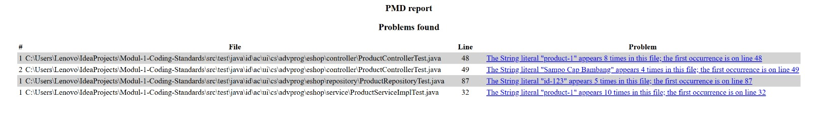

# Modul-1-Coding-Standards
Refleksi 1:

Repository ini berisi implementasi manajemen produk menggunakan Spring Boot. Struktur kode dibagi ke dalam layer Model, Repository, Service, dan Controller agar tanggung jawab setiap komponen terisolasi dengan baik. Saya menerapkan prinsip Clean Code melalui penamaan variabel yang jelas dan penggunaan prinsip Single Responsibility.

Untuk aspek keamanan, aplikasi ini menghindari penyimpanan data sensitif di kode dan mengontrol aliran data melalui endpoint yang aman. Workflow Git yang digunakan adalah pengembangan fitur di branch list-product yang kemudian digabungkan menggunakan teknik fast-forward merge. Sebagai langkah perbaikan di masa depan, saya akan menambahkan validasi input dan mekanisme dependency injection yang lebih baik, serta error handling.

Refleksi 2:

Setelah membuat unit test, saya merasa lega bahwa kode yang saya buat berjalan dengan benar. Menurut saya, dalam satu class jumlah unit test tidak bisa ditentukan, tetapi idealnya ada test untuk setiap method dan skenario-skenario penting seperti positif dan negatif. Untuk memasikan bahwa unit test kita sudah cukup bisa dilihat dari code coveragenya, kalau dikira sudah cukup tinggi maka unit test cukup untuk memastikan kode kita sudah bagus. Code coverage 100% tidak menjamin kalau kode tersebut aman dari bug atau error, bisa saja logic error dan edge casesnya tidak terpenuhi.

Selanjutnya, terkait skenario pembuatan functional test suite baru untuk memverifikasi jumlah item dalam daftar produk, jika saya membuatnya dengan menyalin prosedur setup dan variabel instance yang sama persis dari kelas CreateProductFunctionalTest, hal ini akan berdampak buruk pada kebersihan dan kualitas kode. Pendekatan copy-paste tersebut melanggar prinsip Clean Code, khususnya prinsip Don't Repeat Yourself (DRY), karena menciptakan duplikasi kode yang tidak perlu (code duplication). Duplikasi ini akan menyulitkan pemeliharaan kode dalam jangka panjang; misalnya, jika konfigurasi port atau base URL berubah, saya harus memperbaruinya secara manual di setiap file tes yang menduplikasi kode tersebut, yang meningkatkan risiko inkonsistensi dan kesalahan. Untuk meningkatkan kebersihan kode, saya menyarankan pembuatan kelas dasar (Base Test Class) yang menangani seluruh konfigurasi umum, sehingga kelas-kelas tes fungsional lainnya cukup mewarisi (extend) kelas tersebut tanpa perlu menulis ulang logika setup yang sama.

Refleksi 3:

1. Selama exercise ini, saya memperbaiki beberapa isu kualitas kode. Isu pertama adalah kegagalan unit test karena data uji tidak konsisten, misalnya perbedaan nilai yang di-assert dengan payload request pada `ProductControllerTest` dan ketidaksesuaian `productId` pada skenario update di `ProductRepositoryTest`. Strategi yang saya pakai adalah membaca baris error dari output Gradle, lalu menyamakan data pada tahap arrange-act-assert agar test benar-benar memvalidasi perilaku yang diinginkan. Selain itu, saya juga memperbaiki isu PMD `AvoidDuplicateLiterals` pada test dengan mengekstrak string literal yang berulang menjadi konstanta agar kode lebih rapi, mudah dirawat, dan lolos pemeriksaan.

2. Menurut saya, implementasi saat ini sudah memenuhi definisi Continuous Integration (CI) karena setiap perubahan kode pada event `push` dan `pull_request` langsung memicu workflow otomatis untuk menjalankan build, test suite, dan static analysis. Praktik ini memastikan proses integrasi tidak lagi bergantung pada pengecekan manual developer, sehingga masalah seperti test failure atau pelanggaran aturan kualitas bisa terdeteksi lebih awal. Dengan adanya validasi otomatis sebelum merge, kualitas branch utama menjadi lebih stabil dan risiko bug yang lolos ke tahap berikutnya dapat ditekan. Selain itu, hasil pipeline yang konsisten juga membantu tim melakukan troubleshooting lebih cepat karena sumber kegagalan sudah terlokalisasi di tahap yang jelas.

Dari sisi Continuous Deployment (CD), implementasi ini juga sudah mengarah ke praktik CD karena perubahan yang lolos tahapan CI dapat dipublikasikan ke environment PaaS secara otomatis melalui pipeline, tanpa proses release manual yang panjang. Alur tersebut membuat delivery lebih cepat, frekuensi rilis meningkat, dan feedback dari pengguna bisa didapat lebih dini. 

Link Koyeb: yawning-rory-fakhrihusainiromza-491da2f4.koyeb.app/

Refleksi 4: SOLID
1) Prinsip yang saya terapkan
- Single Responsibility Principle (SRP): Repository fokus pada akses data, service fokus pada aturan bisnis, controller fokus pada HTTP/mapping view. Selain itu, implementasi penyimpanan dipisah.
- Open/Closed Principle (OCP): Dengan adanya interface repository, saya bisa menambah implementasi baru tanpa mengubah service/controller.
- Liskov Substitution Principle (LSP): Service hanya bergantung pada interface `ProductRepository`/`CarRepository`, sehingga implementasi apa pun aman tanpa merusak behaviour.
- Interface Segregation Principle (ISP): Service dibuat spesifik per domain (`ProductService`, `CarService`) sehingga controller hanya bergantung pada method yang relevan.
- Dependency Inversion Principle (DIP): Service dan controller menggunakan constructor injection dan bergantung pada interface (abstraksi), bukan kelas konkret.

2) Keuntungan menerapkan SOLID (dengan contoh)
- Kode lebih mudah diuji: Dengan DIP, `ProductServiceImpl` hanya bergantung pada `ProductRepository` sehingga di test bisa memakai mock. Contoh: `ProductServiceImplTest` hanya memverifikasi interaksi tanpa menyentuh data.
- Perubahan tidak merembet: Dengan OCP + LSP, ketika ingin mengganti penyimpanan dari `InMemoryProductRepository` ke database, saya cukup menambah implementasi baru tanpa mengubah service/controller.
- Tanggung jawab lebih jelas: SRP membuat perubahan di layer tertentu tidak mengganggu layer lain. Contoh: perubahan format view di controller tidak memaksa perubahan logic repository.

3) Kerugian jika tidak menerapkan SOLID (dengan contoh)
- Sulit dipelihara: Jika controller langsung membuat dan mengelola data, perubahan aturan bisnis akan menuntut perubahan di banyak kelas.
- Pengujian rumit: Tanpa DIP, service harus memakai repository konkret sehingga unit test berubah menjadi integrasi dan sulit diisolasi.
- Risiko regresi tinggi: Tanpa OCP/LSP, menambah jenis penyimpanan baru akan memaksa modifikasi kelas lama, sehingga peluang bug meningkat.

Refleksi 5:

1) Refleksi terhadap Workflow TDD

Pada latihan ini saya mengikuti workflow Test-Driven Development (TDD) di mana test dibuat terlebih dahulu sebelum implementasi kode. Berdasarkan Percival (2017) dalam *Principles and Best Practice of Testing*, pendekatan ini membantu pengembang memahami perilaku sistem yang diharapkan sebelum menulis implementasi sebenarnya.

Menurut saya, workflow TDD cukup membantu karena membuat proses pengembangan lebih terarah. Dengan menulis test terlebih dahulu, saya dapat mengetahui kebutuhan sistem dengan lebih jelas. Ketika test gagal, hal tersebut menjadi panduan untuk menambahkan implementasi yang diperlukan agar test tersebut berhasil. Selain itu, dengan menjalankan test secara berkala, saya dapat memastikan bahwa perubahan pada kode tidak merusak fungsi yang sudah ada sebelumnya.

Namun, masih ada beberapa hal yang dapat diperbaiki di masa depan. Misalnya, saya perlu membuat lebih banyak test case yang mencakup berbagai kemungkinan kondisi seperti edge cases atau kondisi batas. Selain itu, saya juga perlu lebih memperhatikan struktur penulisan test agar lebih mudah dipahami dan merepresentasikan perilaku sistem dengan lebih jelas.

---

2) Refleksi terhadap Prinsip F.I.R.S.T

Unit test yang dibuat dalam tutorial ini secara umum telah mengikuti prinsip F.I.R.S.T:

- **Fast**: Test dapat dijalankan dengan cepat karena menggunakan logika sederhana dan dependency seperti repository dimock menggunakan Mockito.
- **Independent**: Setiap test berdiri sendiri dan tidak bergantung pada test lainnya. Penggunaan `@BeforeEach` membantu memastikan data test selalu diinisialisasi ulang sebelum setiap test dijalankan.
- **Repeatable**: Test menghasilkan hasil yang konsisten setiap kali dijalankan karena tidak bergantung pada sistem eksternal seperti database atau jaringan.
- **Self-validating**: Setiap test memiliki assertion yang secara otomatis menentukan apakah test berhasil atau gagal.
- **Timely**: Test dibuat sebelum atau bersamaan dengan implementasi kode sesuai dengan pendekatan TDD.

Meskipun sebagian besar prinsip F.I.R.S.T sudah terpenuhi, masih ada beberapa hal yang bisa ditingkatkan. Misalnya, penamaan test bisa dibuat lebih deskriptif agar lebih mudah dipahami. Selain itu, menambahkan lebih banyak test untuk kondisi error atau edge cases juga dapat meningkatkan kualitas dan keandalan pengujian.

Refleksi Bonus 2 (Refactor Kode Teman):

1) Pendapat saya tentang kode partner

Kode partner saya sudah berjalan dan memenuhi fitur utama payment. Struktur dasarnya sudah baik, tetapi masih ada kekurangan pada maintainability: dependency service masih cukup erat ke implementasi konkret validator, ada penggunaan magic string untuk status, dan pola pemetaan validator belum cukup fleksibel untuk penambahan metode pembayaran baru.

2) Kontribusi yang saya lakukan

Saya berkontribusi dengan melakukan refactor terarah tanpa mengubah perilaku bisnis. Saya memperbaiki struktur dependency di service payment, merapikan kontrak validator agar lebih mudah diperluas, menyesuaikan unit test setelah perubahan desain, dan memverifikasi stabilitas aplikasi lewat pengujian otomatis.

3) Code smell yang saya temukan

- Tight coupling antara `PaymentServiceImpl` dan validator konkret.
- Magic string pada status order (contoh nilai status gagal yang ditulis literal).
- Kurang extensible karena pemilihan validator belum berbasis kontrak method yang didukung validator.
- Dependency kurang eksplisit akibat penggunaan field injection.

4) Langkah refactor yang saya sarankan dan eksekusi

- Menambahkan kontrak `supportedMethod()` pada `PaymentDataValidator`.
- Mengubah service payment ke constructor injection dan menerima kumpulan validator dari Spring DI.
- Membangun registry validator berdasarkan method yang didukung masing-masing validator.
- Mengganti magic string status order dengan enum (`OrderStatus`) agar lebih aman dan konsisten.
- Memperbarui test agar tetap valid terhadap desain baru dan memastikan tidak ada regresi lewat `test` serta `functionalTest`.

